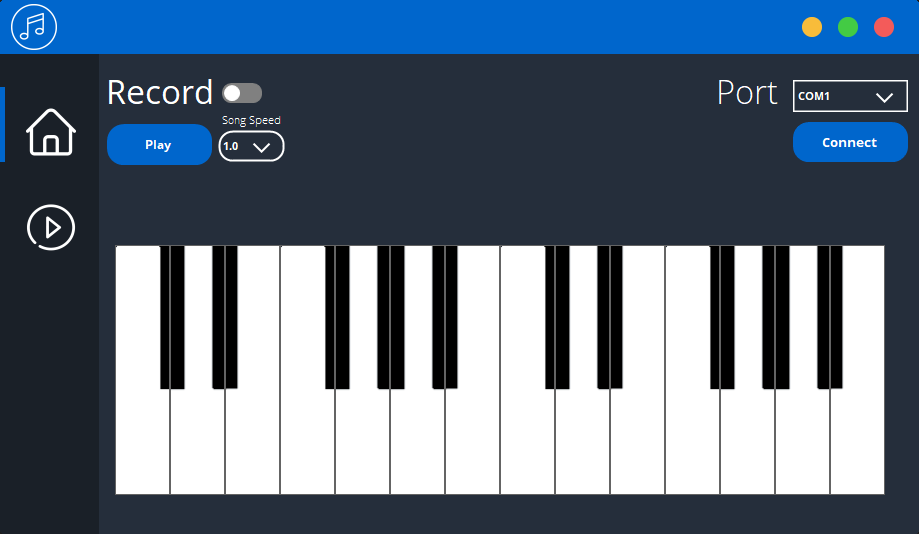

# RGB PIANO

## ÖZET 

Bu bitirme çalışması G.T.U. Bilgisayar Mühendisliği bölümü 4. Sınıfda hazırlanacak Lisans Bitirme Projesi içeriğini, projenin yapılma nedenini ve amacını, projenin gereksinimlerini, sistem mimarisini, başarı kriterlerini, kullanılacak olan donanım hakkında bilgiler, donanım fonksiyonları ve donanımın nasıl kullanılacağı hakkında bilgiler içermektedir.
Bu projede yerel ağın izlenebilmesini , ağda bulunan cihazların bulunmasını , tanımlanmasını ve kategorize edilmesini sağlayan bir ağ görüntüleme sistemi tasarlanmıştır. Ağ izleme yazılımlarıyla Router, Server, switch ve diğer önemli network cihazları veya uygulamalar gibi belirlenmiş hostlardan istatikler toplanır, Network trafiği detayı, CPU değerleri, disk kullanımı, Up-Down durumu gibi önemli verileri kontrol edilebilir. 
Ağ cihazlarını keşfetme ve ip , mac gibi basit bilgileri edinmek için Nmap kullanılmıştır.Nmap ile alınan veriler düzenlenerek parametre olarak Fing’e gönderilir ve detaylı cihaz bilgileri mac adresleri sayesinde öğrenilir ve kategorize edilir.Python üzerinde flask ile yazılmış web servis aracılığıyla arayüzü yazmak için kullanılan React ‘a iletilir.Arayüz üzerinde seçilen cihaza ait daha detaylı bilgilere SNMP aracılığıyla ulaşılır.

 
## SUMMARY
This graduation work is made by G.T.U. The Computer Engineering department contains the content of the Undergraduate Completion Project to be prepared in the 4th grade, the reason and purpose of the project, the requirements of the project, the system architecture, the criteria of success, information about the hardware to be used, hardware functions and how to use the hardware.
In this project, a network imaging system is designed that allows the local network to be monitored, the devices found on the network to be identified, identified and categorized. With network monitoring software, statistics are collected from designated hosts such as Router, Server, switch and other important network devices or applications. Important data such as network traffic details, CPU values, disk usage, Up-Down status can be checked.
Nmap is used to discover network devices and to obtain simple information such as ip and mac. The data received with Nmap is edited and sent to Fing as a parameter, and detailed device information is learned and categorized through mac addresses. Used to write the interface via flask written web service on Python. It is transmitted to React. More detailed information about the device selected on the interface is accessed via SNMP. 

## Introduction

Günümüzde internet ve ağ kullanımı bir hayli yaygın hale gelmiştir. Bununla birlikte çoğu kurum işlerini bilişim sektörüne taşımış ve burada devam ettirmektedirler. Bunun sonucu olarak yerel ağın sürekli takip edilmesi ve ağda olup bitenin bilinme ihtiyacı doğmuştur. 
Bu ihtiyaç doğrultusunda monitoring uygulamaları geliştirilmeye başlanmıştır. Ağ ve sistem tarafında kritik olarak görülen donanımın tamamının anlık kontrol edilebilmesi ve müdahale edilebilmesi durumuna monitoring denilmektedir. Büyük olarak lanse edilen kurumsal şirketlerde çok diyebileceğimiz sayıda network ve güvenlik teknolojileri bulunmaktadır. Bu teknolojik yapıların kaliteli ve uygun bir şekilde bakımının yapılması gereklidir. Bakımı ve kontrolü yapılmakta olan varlık ve bilgiler kritik seviyede olabilmektedir. Ayrıca yapılarda oluşacak hata durumlarında uyarı mekanizması bulunması ve sorumlu kişilere bilgilendirme mesajının iletilmesi gerekir. İletilen bu mesajların akabinde duruma ve oluşan olaya göre çok hızlı bir şekilde aksiyon alınması sağlanabilir.
Bu nedenlerden dolayı arayüzü web tabanlı bir network monitoring uygulaması geliştirilmesi amaçlanmıştır.

## Screen shots

## project chart and flow chart

